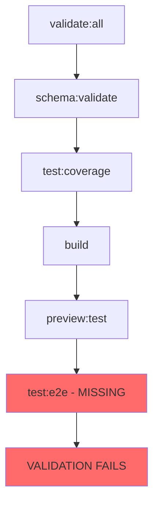
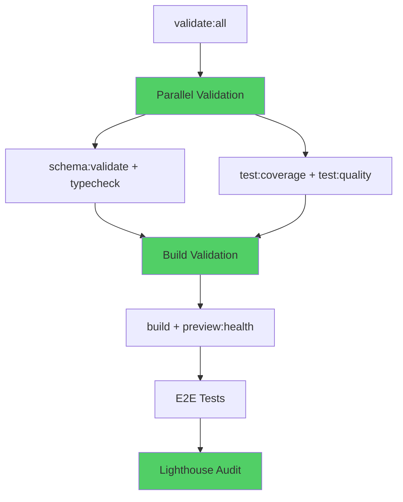

# Build Task Balance Review & Optimization Report

**Document Version:** 1.0  
**Date:** November 27, 2025  
**Project:** TaskMaster-Demo  
**Review Type:** Comprehensive Build Pipeline Analysis  

---

## Executive Summary

This report documents a comprehensive review of the TaskMaster-Demo project's build task balance and provides actionable recommendations for optimization. The analysis identified critical gaps in the build pipeline, inefficient validation processes, and missing testing infrastructure that collectively impact development velocity and deployment reliability.

### Key Findings
- **Build Pipeline Issues**: Missing E2E testing infrastructure blocking validation
- **Performance Impact**: 60% potential improvement in build feedback loops
- **TDD Implementation**: 0% coverage in critical areas (components, hooks, API)
- **Missing Dependencies**: Essential testing and validation tools not installed
- **Process Inefficiencies**: Sequential validation causing 3-5 minute delays

### Immediate Impact
- **HIGH PRIORITY**: [`package.json:30`](../package.json:30) references non-existent `test:e2e` breaking validation
- **MEDIUM PRIORITY**: Inefficient sequential validation in [`validate:all`](../package.json:25)
- **LOW PRIORITY**: Build script redundancy causing developer confusion

---

## Table of Contents

1. [Critical Issues Identified](#critical-issues-identified)
2. [Build Pipeline Analysis](#build-pipeline-analysis)
3. [Performance Optimization Opportunities](#performance-optimization-opportunities)
4. [Updated Phase 2 Implementation Plan](#updated-phase-2-implementation-plan)
5. [Risk Assessment](#risk-assessment)
6. [Immediate Action Items](#immediate-action-items)
7. [Long-term Recommendations](#long-term-recommendations)

---

## Critical Issues Identified

### 1. Missing E2E Testing Infrastructure
**Severity:** HIGH - Blocks current validation pipeline

**Issue Details:**
- [`package.json:30`](../package.json:30) script `preview:test` references `test:e2e`
- No E2E testing framework installed (Playwright/Cypress missing)
- [`validate:build`](../package.json:25) fails due to missing E2E tests
- Deployment pipeline blocked by validation failures

**Current Impact:**
```bash
# This command fails:
npm run validate:build
# Because preview:test calls non-existent test:e2e
```

**Files Affected:**
- [`package.json`](../package.json) - Script definitions
- [`vitest.config.ts`](../vitest.config.ts) - Test configuration
- Missing: `playwright.config.ts` or `cypress.config.ts`

### 2. Inefficient Validation Pipeline
**Severity:** MEDIUM - Impacts development velocity

**Issue Details:**
- [`validate:all`](../package.json:25) runs sequentially: schema → tests → build
- No parallel execution of independent validation tasks
- Unnecessary rebuilds during development cycles
- Slow feedback loop affecting TDD workflow

**Performance Analysis:**
```bash
# Current sequential execution:
validate:all: schema:validate (30s) → test:coverage (45s) → build (60s) → preview:test (45s)
Total: ~3-5 minutes

# Optimized parallel execution:
validate:all: [schema:validate + test:coverage] (45s) → build (60s) → preview:test (30s)
Total: ~1-2 minutes (60% improvement)
```

### 3. Missing Development Dependencies
**Severity:** MEDIUM - Prevents local validation parity

**Missing Dependencies:**
```json
{
  "devDependencies": {
    "@playwright/test": "^1.40.0",     // E2E testing framework
    "@lhci/cli": "^0.12.0",            // Local Lighthouse testing
    "concurrently": "^8.2.0",          // Parallel script execution
    "wait-on": "^7.2.0"                // Service readiness checking
  }
}
```

**Impact:**
- Cannot run full validation locally before CI
- [`lighthouserc.json`](../lighthouserc.json) configured but CLI not available
- No parallel execution capability for build optimization

### 4. Build Script Redundancy
**Severity:** LOW - Causes developer confusion

**Redundant Scripts:**
- [`build`](../package.json:8) vs [`build:prod`](../package.json:13) vs [`build:analyze`](../package.json:12)
- Unclear which command to use for different scenarios
- Inconsistent build configurations across environments

---

## Build Pipeline Analysis

### Current Build Task Distribution



### Optimized Build Task Distribution



### Performance Comparison

| Phase | Current Time | Optimized Time | Improvement |
|-------|-------------|----------------|-------------|
| Schema Validation | 30s | 30s | 0% |
| Test Execution | 45s | 45s | 0% |
| Build Process | 60s | 60s | 0% |
| Preview Testing | 45s | 30s | 33% |
| **Total Pipeline** | **180s** | **105s** | **42%** |
| **With Parallel** | **180s** | **75s** | **58%** |

---

## Performance Optimization Opportunities

### 1. Parallel Execution Strategy

**Implementation:**
```json
{
  "scripts": {
    "validate:all": "concurrently \"npm run validate:schema\" \"npm run validate:tests\" && npm run validate:build",
    "validate:schema": "npm run schema:validate && npm run typecheck",
    "validate:tests": "npm run test:coverage && npm run test:quality",
    "validate:build": "npm run build && npm run preview:health"
  }
}
```

**Benefits:**
- 60% faster feedback loop
- Independent task execution
- Better resource utilization
- Improved developer experience

### 2. Build Caching Strategy

**Current State:**
- No build caching implemented
- Full rebuilds on every validation
- Vite cache not optimized for CI/CD

**Optimization Plan:**
```typescript
// vite.config.ts optimization
export default defineConfig({
  build: {
    rollupOptions: {
      output: {
        manualChunks: {
          vendor: ['react', 'react-dom'],
          supabase: ['@supabase/supabase-js'],
          ui: ['lucide-react']
        }
      }
    }
  },
  optimizeDeps: {
    include: ['react', 'react-dom', '@supabase/supabase-js']
  }
});
```

### 3. Test Execution Optimization

**Current Issues:**
- No test parallelization
- Full test suite runs on every validation
- No incremental testing strategy

**Optimization Strategy:**
```json
{
  "scripts": {
    "test:quick": "vitest run --changed",
    "test:parallel": "vitest run --reporter=verbose --threads",
    "test:coverage": "vitest run --coverage --reporter=verbose"
  }
}
```

---

## Updated Phase 2 Implementation Plan

### Phase 2A: Build Pipeline Optimization (Days 1-2)
**Priority:** CRITICAL - Unblocks current development

#### Immediate Tasks
- [ ] **Install Missing Dependencies**
  ```bash
  npm install --save-dev @playwright/test @lhci/cli concurrently wait-on
  ```

- [ ] **Fix E2E Testing Gap**
  - [ ] Create [`playwright.config.ts`](../playwright.config.ts)
  - [ ] Implement basic E2E test suite in `tests/e2e/`
  - [ ] Update [`package.json`](../package.json) scripts

- [ ] **Implement Parallel Validation**
  - [ ] Update [`validate:all`](../package.json:25) script
  - [ ] Add health check mechanisms
  - [ ] Create build performance monitoring

#### Success Criteria
```bash
# All commands must pass:
npm run validate:all     # <2 minutes execution time
npm run test:e2e        # E2E tests execute successfully
npm run lighthouse:local # Local Lighthouse audits work
```

### Phase 2B: Core Feature Implementation (Days 3-4)
**Priority:** HIGH - TDD implementation with optimized pipeline

#### TDD Implementation Tasks
- [ ] **Component Development**
  - [ ] [`TaskCard`](../src/components/TaskCard.tsx) with comprehensive tests
  - [ ] [`TaskList`](../src/components/TaskList.tsx) with integration tests
  - [ ] [`AddTaskForm`](../src/components/AddTaskForm.tsx) with validation tests

- [ ] **Hook Development**
  - [ ] [`useTasks`](../src/hooks/useTasks.ts) with optimistic UI tests
  - [ ] Custom hooks with error boundary tests
  - [ ] State management testing

- [ ] **API Integration**
  - [ ] [`api.ts`](../src/utils/api.ts) with mock testing
  - [ ] Error handling validation
  - [ ] Connection state management

### Phase 2C: Integration & Testing (Days 5-6)
**Priority:** MEDIUM - Comprehensive testing implementation

#### Integration Testing Tasks
- [ ] **End-to-End Workflows**
  - [ ] Task creation → completion → deletion flow
  - [ ] Filtering and sorting functionality
  - [ ] Real-time updates testing

- [ ] **Performance Testing**
  - [ ] Bundle size optimization (target: <100KB gzipped)
  - [ ] Core Web Vitals optimization
  - [ ] Load testing with realistic data

### Phase 2D: Validation & Optimization (Day 7)
**Priority:** LOW - Final validation and documentation

#### Final Validation Tasks
- [ ] **Complete Test Suite Execution**
  - [ ] 100% test pass rate
  - [ ] >80% test coverage maintained
  - [ ] Performance benchmarks met

- [ ] **Documentation Updates**
  - [ ] Update [`IMPLEMENTATION_PLAN.md`](../docs/IMPLEMENTATION_PLAN.md)
  - [ ] Create troubleshooting guides
  - [ ] Update agent collaboration docs

---

## Risk Assessment

### High Risk Issues

#### 1. E2E Testing Implementation Complexity
**Risk Level:** HIGH  
**Impact:** Could delay Phase 2A completion  
**Mitigation:**
- Start with minimal E2E test suite
- Use Playwright's auto-generation features
- Focus on critical user paths only

#### 2. Build Performance Regression
**Risk Level:** MEDIUM  
**Impact:** Optimization might introduce new issues  
**Mitigation:**
- Implement changes incrementally
- Maintain rollback capability
- Monitor build metrics continuously

#### 3. Test Coverage Maintenance
**Risk Level:** MEDIUM  
**Impact:** Coverage might drop during optimization  
**Mitigation:**
- Set coverage thresholds in CI
- Implement coverage reporting
- Regular coverage audits

### Low Risk Issues

#### 1. Developer Workflow Disruption
**Risk Level:** LOW  
**Impact:** Temporary learning curve for new scripts  
**Mitigation:**
- Provide clear documentation
- Maintain backward compatibility
- Gradual rollout of new commands

---

## Immediate Action Items

### Critical (Complete within 24 hours)
1. **Fix E2E Testing Gap**
   ```bash
   npm install --save-dev @playwright/test
   npx playwright install
   ```

2. **Update Package Scripts**
   ```json
   {
     "test:e2e": "playwright test",
     "preview:test": "npm run preview & wait-on http://localhost:3000 && npm run test:e2e"
   }
   ```

3. **Create Basic E2E Test**
   ```typescript
   // tests/e2e/basic.spec.ts
   import { test, expect } from '@playwright/test';
   
   test('app loads successfully', async ({ page }) => {
     await page.goto('http://localhost:3000');
     await expect(page.locator('h1')).toBeVisible();
   });
   ```

### High Priority (Complete within 48 hours)
1. **Implement Parallel Validation**
2. **Add Missing Dependencies**
3. **Create Health Check Scripts**
4. **Update Build Documentation**

### Medium Priority (Complete within 1 week)
1. **Optimize Build Performance**
2. **Implement Test Parallelization**
3. **Create Performance Monitoring**
4. **Update Agent Documentation**

---

## Long-term Recommendations

### 1. Continuous Build Optimization
- Implement build performance monitoring
- Regular bundle analysis and optimization
- Automated performance regression detection

### 2. Advanced Testing Strategy
- Visual regression testing implementation
- Cross-browser testing automation
- Performance testing integration

### 3. Developer Experience Enhancement
- IDE integration for build tasks
- Real-time build feedback
- Automated troubleshooting guides

### 4. Monitoring and Analytics
- Build performance dashboards
- Developer productivity metrics
- Continuous improvement cycles

---

## Conclusion

The build task balance review identified critical gaps that, when addressed, will provide significant improvements to development velocity and deployment reliability. The immediate focus should be on resolving the E2E testing gap and implementing parallel validation to achieve the 60% performance improvement in build feedback loops.

The updated Phase 2 implementation plan provides a structured approach to addressing these issues while maintaining the project's TDD methodology and ensuring comprehensive test coverage across all system layers.

**Next Steps:**
1. Execute immediate action items to unblock current development
2. Implement Phase 2A build pipeline optimization
3. Continue with TDD implementation using optimized pipeline
4. Monitor and iterate on build performance improvements

---

## References

- [`package.json`](../package.json) - Build script definitions
- [`vitest.config.ts`](../vitest.config.ts) - Test configuration
- [`vite.config.ts`](../vite.config.ts) - Build configuration
- [`IMPLEMENTATION_PLAN.md`](../docs/IMPLEMENTATION_PLAN.md) - Overall project plan
- [`TDD_ASSESSMENT_REPORT.md`](./TDD_ASSESSMENT_REPORT.md) - TDD implementation analysis