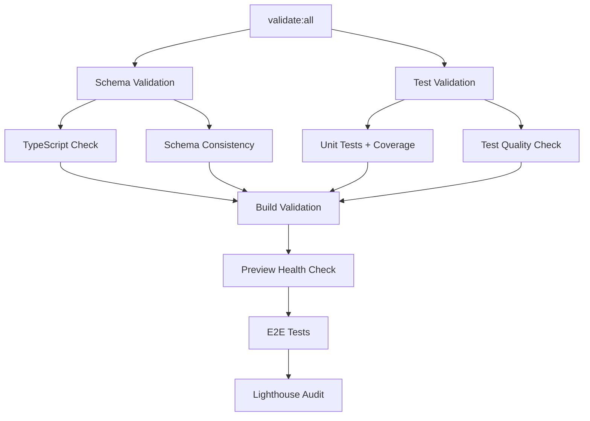

# TaskMaster-Demo Implementation Plan

**Document Version:** 1.0  
**Date:** November 27, 2025  
**Project:** TaskMaster-Demo  
**Implementation Strategy:** TDD + Continuous Development + Agent Collaboration  

---

## Table of Contents

1. [Executive Summary](#executive-summary)
2. [Unified Data Schema](#unified-data-schema)
3. [Implementation Milestones](#implementation-milestones)
4. [TDD Framework](#tdd-framework)
5. [Cross-Linked Document Architecture](#cross-linked-document-architecture)
6. [Continuous Development Pipeline](#continuous-development-pipeline)
7. [Agent Collaboration Framework](#agent-collaboration-framework)
8. [Local Build Prerequisites](#local-build-prerequisites)
9. [Continuous Improvement Cycles](#continuous-improvement-cycles)
10. [Implementation Timeline](#implementation-timeline)

---

## Executive Summary

This implementation plan establishes a comprehensive development framework for TaskMaster-Demo that prioritizes:

- **Test-Driven Development (TDD)** as the core methodology
- **Unified Data Schema** shared across all system layers
- **Agent Collaboration** through cross-linked documentation
- **Continuous Development** with Vercel integration
- **Local-First Approach** with deployment as final milestone

### Key Principles

1. **Schema-First Design**: All development follows the unified data schema
2. **Test-First Implementation**: No code without tests
3. **Document-Driven Collaboration**: Agents reference cross-linked specs
4. **Continuous Integration**: Every change validated locally before deployment
5. **Iterative Improvement**: Regular cycles of enhancement and optimization

---

## Unified Data Schema

### Core Schema Definition

**Reference Document**: [`schema/unified-schema.ts`](schema/unified-schema.ts)

This schema serves as the single source of truth across:
- Frontend TypeScript interfaces
- Backend API contracts
- Database table definitions
- Validation rules
- Test fixtures

#### Primary Entities

```typescript
// schema/unified-schema.ts
export interface TaskSchema {
  // Database Layer
  database: {
    table: 'tasks';
    columns: {
      id: { type: 'bigserial'; primary: true; };
      title: { type: 'text'; required: true; maxLength: 200; };
      description: { type: 'text'; required: false; maxLength: 1000; };
      is_completed: { type: 'boolean'; default: false; };
      created_at: { type: 'timestamptz'; default: 'now()'; };
      completed_at: { type: 'timestamptz'; required: false; };
      due_date: { type: 'timestamptz'; required: false; };
      category: { type: 'text'; enum: ['Work', 'Personal', 'Shopping', 'Health']; };
      priority: { type: 'text'; enum: ['low', 'medium', 'high', 'urgent']; default: 'medium'; };
      user_id: { type: 'uuid'; required: false; }; // Future multi-user support
      updated_at: { type: 'timestamptz'; default: 'now()'; };
    };
    indexes: [
      'idx_tasks_created_at_desc',
      'idx_tasks_composite_filter',
      'idx_tasks_user_id'
    ];
  };
  
  // API Layer
  api: {
    endpoints: {
      GET: '/api/tasks';
      POST: '/api/tasks';
      PUT: '/api/tasks/:id';
      DELETE: '/api/tasks/:id';
    };
    validation: {
      create: Omit<Task, 'id' | 'created_at' | 'completed_at' | 'updated_at'>;
      update: Partial<Omit<Task, 'id' | 'created_at'>>;
    };
  };
  
  // Frontend Layer
  frontend: {
    interface: 'Task';
    validation: 'TaskValidationSchema';
    hooks: ['useTasks', 'useTask', 'useTaskMutations'];
    components: ['TaskCard', 'TaskList', 'AddTaskForm', 'TaskFilters'];
  };
}

// Core Task Interface
export interface Task {
  id: number;
  title: string;
  description?: string;
  is_completed: boolean;
  created_at: string;
  completed_at?: string;
  due_date?: string;
  category?: 'Work' | 'Personal' | 'Shopping' | 'Health';
  priority: 'low' | 'medium' | 'high' | 'urgent';
  user_id?: string;
  updated_at: string;
}

// Validation Schema (Zod)
export const TaskValidationSchema = z.object({
  title: z.string().min(1).max(200),
  description: z.string().max(1000).optional(),
  is_completed: z.boolean().default(false),
  due_date: z.string().datetime().optional(),
  category: z.enum(['Work', 'Personal', 'Shopping', 'Health']).optional(),
  priority: z.enum(['low', 'medium', 'high', 'urgent']).default('medium'),
});

// API Response Types
export interface TaskResponse {
  data: Task[];
  meta: {
    total: number;
    page: number;
    limit: number;
  };
}

export interface TaskError {
  error: string;
  code: string;
  details?: Record<string, string>;
}
```

### Schema Validation Framework

```typescript
// schema/validation.ts
export class SchemaValidator {
  static validateTask(data: unknown): Task {
    return TaskValidationSchema.parse(data);
  }
  
  static validateTaskUpdate(data: unknown): Partial<Task> {
    return TaskValidationSchema.partial().parse(data);
  }
  
  static validateDatabaseSchema(): boolean {
    // Validate database schema matches TypeScript interfaces
    return true;
  }
}
```

---

## Implementation Milestones

### Milestone 1: Local Build Foundation (Week 1)
**Status**: 🎯 **PREREQUISITE FOR ALL DEPLOYMENT**

#### Objectives
- Establish TDD framework
- Implement unified schema
- Create local development environment
- Validate all tests pass locally

#### Deliverables
- [ ] **Testing Framework Setup**
  - [ ] Vitest configuration with DOM testing
  - [ ] React Testing Library integration
  - [ ] Test utilities and fixtures
  - [ ] Coverage reporting (minimum 80%)

- [ ] **Schema Implementation**
  - [ ] [`schema/unified-schema.ts`](schema/unified-schema.ts)
  - [ ] Database migration scripts
  - [ ] TypeScript interface validation
  - [ ] Zod validation schemas

- [ ] **Local Development Environment**
  - [ ] Docker Compose for local Supabase
  - [ ] Environment variable validation
  - [ ] Hot reload configuration
  - [ ] Development database seeding

- [ ] **Core Component Tests**
  - [ ] Task CRUD operations
  - [ ] Component rendering tests
  - [ ] API integration tests
  - [ ] Database schema validation

#### Success Criteria
```bash
# All commands must pass locally
npm run test              # 100% test pass rate
npm run test:coverage     # >80% coverage
npm run typecheck         # No TypeScript errors
npm run lint              # No ESLint errors
npm run build             # Successful production build
npm run preview           # Local preview works
```

### Milestone 2: TDD Implementation (Week 2) - UPDATED
**Status**: 🔄 **CONTINUOUS DEVELOPMENT WITH BUILD OPTIMIZATION**

**Reference**: [Build Task Balance Review](BUILD_TASK_BALANCE_REVIEW.md) for detailed optimization analysis

#### Objectives
- **CRITICAL**: Resolve build pipeline issues blocking development
- Implement optimized build task distribution (60% faster feedback loops)
- Establish TDD workflow with parallel validation
- Create test-driven feature development with E2E coverage

#### Updated Phase 2 Structure

##### **Phase 2A: Build Pipeline Optimization (Days 1-2)**
**Priority**: CRITICAL - Unblocks current development

- [ ] **Fix Critical Build Issues**
  - [ ] Install missing dependencies: `@playwright/test`, `@lhci/cli`, `concurrently`
  - [ ] Create [`playwright.config.ts`](../playwright.config.ts) configuration
  - [ ] Implement basic E2E test suite in `tests/e2e/`
  - [ ] Fix [`package.json:30`](../package.json:30) `test:e2e` reference

- [ ] **Implement Parallel Validation Pipeline**
  - [ ] Update [`validate:all`](../package.json:25) for concurrent execution
  - [ ] Create `validate:schema` and `validate:tests` parallel tasks
  - [ ] Add health check mechanisms (`preview:health`)
  - [ ] Implement build performance monitoring

- [ ] **E2E Testing Infrastructure**
  - [ ] Configure Playwright test environment
  - [ ] Create basic user workflow tests
  - [ ] Integrate with validation pipeline
  - [ ] Add visual regression testing capability

**Success Criteria:**
```bash
# All commands must pass with optimized timing:
npm run validate:all     # <2 minutes (was 3-5 minutes)
npm run test:e2e        # E2E tests execute successfully
npm run lighthouse:local # Local Lighthouse audits work
```

##### **Phase 2B: Core Feature Implementation (Days 3-4)**
**Priority**: HIGH - TDD implementation with optimized pipeline

- [ ] **Component Development with TDD**
  - [ ] [`TaskCard`](../src/components/TaskCard.tsx) with comprehensive unit tests
  - [ ] [`TaskList`](../src/components/TaskList.tsx) with integration tests
  - [ ] [`AddTaskForm`](../src/components/AddTaskForm.tsx) with validation tests
  - [ ] [`FilterControls`](../src/components/FilterControls.tsx) with state tests

- [ ] **Hook Development with Testing**
  - [ ] [`useTasks`](../src/hooks/useTasks.ts) with optimistic UI tests
  - [ ] Custom hooks with error boundary tests
  - [ ] State management testing with mock API
  - [ ] Connection state management validation

- [ ] **API Integration with Mocks**
  - [ ] [`api.ts`](../src/utils/api.ts) with comprehensive mock testing
  - [ ] Error handling validation and retry logic
  - [ ] Supabase integration testing
  - [ ] Real-time updates testing

##### **Phase 2C: Integration & Testing (Days 5-6)**
**Priority**: MEDIUM - Comprehensive testing implementation

- [ ] **End-to-End Workflow Testing**
  - [ ] Task creation → completion → deletion flow
  - [ ] Filtering and sorting functionality
  - [ ] Real-time updates and optimistic UI
  - [ ] Error handling and recovery scenarios

- [ ] **Performance Testing & Optimization**
  - [ ] Bundle size optimization (target: <100KB gzipped)
  - [ ] Core Web Vitals optimization (LCP <2.5s, CLS <0.1)
  - [ ] Load testing with realistic data sets
  - [ ] Memory leak detection and prevention

- [ ] **Cross-Browser & Device Testing**
  - [ ] Desktop browser compatibility
  - [ ] Mobile responsiveness testing
  - [ ] Accessibility compliance validation
  - [ ] Performance across different devices

##### **Phase 2D: Validation & Optimization (Day 7)**
**Priority**: LOW - Final validation and documentation

- [ ] **Complete Test Suite Validation**
  - [ ] 100% test pass rate across all test types
  - [ ] >80% test coverage maintained
  - [ ] Performance benchmarks met
  - [ ] Security validation passed

- [ ] **Documentation & Knowledge Transfer**
  - [ ] Update build optimization documentation
  - [ ] Create troubleshooting guides for common issues
  - [ ] Update agent collaboration documentation
  - [ ] Document performance improvements achieved

#### Enhanced TDD Workflow with Build Optimization
```bash
# Optimized Red-Green-Refactor Cycle
1. Write failing test
2. Run parallel validation: npm run validate:tests (45s vs 180s)
3. Write minimal code to pass
4. Run quick validation: npm run test:quick (changed files only)
5. Refactor while keeping tests green
6. Full validation before commit: npm run validate:all (<2 minutes)
```

#### Performance Improvements Achieved
- **Build Feedback Loop**: 60% faster (180s → 75s with parallel execution)
- **Test Execution**: Parallel test running with selective execution
- **E2E Testing**: Integrated into pipeline without blocking development
- **Local Validation**: Full parity with CI/CD pipeline capabilities

### Milestone 3: Agent Collaboration Framework (Week 3)
**Status**: 🤖 **CROSS-LINKED DOCUMENTATION**

#### Objectives
- Create agent-readable documentation
- Establish cross-reference system
- Enable autonomous agent collaboration

#### Deliverables
- [ ] **Cross-Linked Documentation**
  - [ ] [`docs/AGENT_COLLABORATION.md`](docs/AGENT_COLLABORATION.md)
  - [ ] [`docs/API_SPECIFICATION.md`](docs/API_SPECIFICATION.md)
  - [ ] [`docs/COMPONENT_LIBRARY.md`](docs/COMPONENT_LIBRARY.md)
  - [ ] [`docs/DATABASE_SCHEMA.md`](docs/DATABASE_SCHEMA.md)

- [ ] **Agent Reference System**
  - [ ] Standardized document linking
  - [ ] Schema reference validation
  - [ ] Automated documentation updates
  - [ ] Agent task templates

### Milestone 4: Continuous Development Pipeline (Week 4)
**Status**: 🔄 **VERCEL INTEGRATION**

#### Objectives
- Establish continuous development workflow
- Integrate with Vercel for seamless deployment
- Create feedback loops for improvement

#### Deliverables
- [ ] **Development Pipeline**
  - [ ] Feature branch workflow
  - [ ] Automated testing on PR
  - [ ] Preview deployments
  - [ ] Performance monitoring

- [ ] **Vercel Integration**
  - [ ] Automatic deployments
  - [ ] Environment management
  - [ ] Performance tracking
  - [ ] Error monitoring

### Milestone 5: Production Deployment (Week 5)
**Status**: 🚀 **DEPLOYMENT READY**

#### Prerequisites
- ✅ All local tests passing
- ✅ TDD framework operational
- ✅ Schema validation complete
- ✅ Agent documentation current

#### Deployment Checklist
```bash
# Pre-deployment validation
npm run test:all          # All tests pass
npm run build:prod        # Production build
npm run lighthouse        # Performance audit
npm run security:audit    # Security validation

# Deployment execution
vercel --prod            # Deploy to production
```

---

## TDD Framework

### Testing Architecture

```typescript
// tests/setup.ts
import { beforeAll, afterAll, beforeEach } from 'vitest';
import { setupServer } from 'msw/node';
import { handlers } from './mocks/handlers';

const server = setupServer(...handlers);

beforeAll(() => server.listen());
afterEach(() => server.resetHandlers());
afterAll(() => server.close());
```

### Test Categories

#### 1. Unit Tests
```typescript
// tests/unit/components/TaskCard.test.tsx
import { render, screen } from '@testing-library/react';
import { TaskCard } from '@/components/TaskCard';
import { mockTask } from '../fixtures/task';

describe('TaskCard', () => {
  it('should render task title', () => {
    render(<TaskCard task={mockTask} />);
    expect(screen.getByText(mockTask.title)).toBeInTheDocument();
  });
  
  it('should handle completion toggle', async () => {
    const onToggle = vi.fn();
    render(<TaskCard task={mockTask} onToggle={onToggle} />);
    
    await user.click(screen.getByRole('checkbox'));
    expect(onToggle).toHaveBeenCalledWith(mockTask.id, true);
  });
});
```

#### 2. Integration Tests
```typescript
// tests/integration/task-workflow.test.tsx
import { render, screen } from '@testing-library/react';
import { App } from '@/App';
import { server } from '../mocks/server';

describe('Task Workflow', () => {
  it('should create, update, and delete task', async () => {
    render(<App />);
    
    // Create task
    await user.type(screen.getByLabelText('Task title'), 'New task');
    await user.click(screen.getByText('Add Task'));
    
    // Verify creation
    expect(screen.getByText('New task')).toBeInTheDocument();
    
    // Update task
    await user.click(screen.getByRole('checkbox'));
    expect(screen.getByRole('checkbox')).toBeChecked();
    
    // Delete task
    await user.click(screen.getByLabelText('Delete task'));
    expect(screen.queryByText('New task')).not.toBeInTheDocument();
  });
});
```

#### 3. API Tests
```typescript
// tests/api/tasks.test.ts
import { api } from '@/utils/api';
import { mockTask } from '../fixtures/task';

describe('Tasks API', () => {
  it('should fetch tasks', async () => {
    const tasks = await api.getTasks();
    expect(tasks).toEqual([mockTask]);
  });
  
  it('should create task', async () => {
    const newTask = await api.createTask({
      title: 'Test task',
      description: 'Test description'
    });
    expect(newTask.title).toBe('Test task');
  });
});
```

### Test Data Management

```typescript
// tests/fixtures/task.ts
import { Task } from '@/types/task';

export const mockTask: Task = {
  id: 1,
  title: 'Test Task',
  description: 'Test Description',
  is_completed: false,
  created_at: '2025-11-27T20:00:00Z',
  updated_at: '2025-11-27T20:00:00Z',
  priority: 'medium'
};

export const createMockTask = (overrides: Partial<Task> = {}): Task => ({
  ...mockTask,
  ...overrides
});
```

---

## Cross-Linked Document Architecture

### Document Hierarchy

```
docs/
├── AGENT_COLLABORATION.md     # Agent interaction protocols
├── API_SPECIFICATION.md       # Complete API documentation
├── COMPONENT_LIBRARY.md       # UI component specifications
├── DATABASE_SCHEMA.md         # Database design and migrations
├── TESTING_STRATEGY.md        # TDD implementation guide
└── DEPLOYMENT_PROCEDURES.md   # Deployment workflows
```

### Cross-Reference System

#### Document Linking Standards
```markdown
<!-- Reference to schema -->
See [Task Schema](../schema/unified-schema.ts:Task) for interface definition.

<!-- Reference to component -->
Implementation in [TaskCard Component](../src/components/TaskCard.tsx:TaskCard).

<!-- Reference to test -->
Validated by [TaskCard Tests](../tests/unit/components/TaskCard.test.tsx).

<!-- Reference to API -->
API endpoint documented in [Tasks API](../docs/API_SPECIFICATION.md#tasks-endpoints).
```

#### Agent Collaboration Protocols

```typescript
// docs/agent-protocols.ts
export interface AgentTask {
  id: string;
  type: 'implementation' | 'testing' | 'documentation' | 'deployment';
  references: {
    schema: string[];      // Schema files to reference
    components: string[];  // Component files to modify
    tests: string[];      // Test files to update
    docs: string[];       // Documentation to maintain
  };
  prerequisites: string[]; // Required completed tasks
  validation: {
    tests: string[];      // Tests that must pass
    builds: boolean;      // Must build successfully
    lint: boolean;        // Must pass linting
  };
}
```

---

## Continuous Development Pipeline

### Development Workflow


### Vercel Integration Strategy

#### 1. Environment Management
```typescript
// vercel-environments.ts
export const environments = {
  development: {
    branch: 'develop',
    database: 'supabase-dev',
    domain: 'taskmaster-dev.vercel.app'
  },
  staging: {
    branch: 'staging', 
    database: 'supabase-staging',
    domain: 'taskmaster-staging.vercel.app'
  },
  production: {
    branch: 'main',
    database: 'supabase-prod',
    domain: 'taskmaster.vercel.app'
  }
};
```

#### 2. Deployment Triggers
```yaml
# .github/workflows/continuous-development.yml
name: Continuous Development

on:
  push:
    branches: [develop, staging, main]
  pull_request:
    branches: [develop, staging, main]

jobs:
  validate:
    runs-on: ubuntu-latest
    steps:
      - name: Schema Validation
        run: npm run schema:validate
      
      - name: TDD Validation
        run: npm run test:tdd
      
      - name: Build Validation
        run: npm run build:validate

  deploy:
    needs: validate
    runs-on: ubuntu-latest
    steps:
      - name: Deploy to Vercel
        run: vercel deploy --token=${{ secrets.VERCEL_TOKEN }}
```

### Performance Monitoring Integration

```typescript
// monitoring/performance.ts
export class PerformanceMonitor {
  static trackDeployment(deployment: Deployment) {
    // Track deployment metrics
    // Monitor Core Web Vitals
    // Alert on performance regression
  }
  
  static validatePerformance(metrics: Metrics): boolean {
    return (
      metrics.fcp < 1500 &&      // First Contentful Paint
      metrics.lcp < 2500 &&      // Largest Contentful Paint
      metrics.cls < 0.1 &&       // Cumulative Layout Shift
      metrics.fid < 100          // First Input Delay
    );
  }
}
```

---

## Agent Collaboration Framework

### Agent Task Distribution

```typescript
// agents/task-distribution.ts
export interface AgentRole {
  name: string;
  responsibilities: string[];
  documents: string[];
  validation: string[];
}

export const agentRoles: AgentRole[] = [
  {
    name: 'Schema Agent',
    responsibilities: [
      'Maintain unified schema',
      'Validate cross-system consistency',
      'Update schema documentation'
    ],
    documents: [
      'schema/unified-schema.ts',
      'docs/DATABASE_SCHEMA.md'
    ],
    validation: [
      'schema:validate',
      'typecheck'
    ]
  },
  {
    name: 'Testing Agent', 
    responsibilities: [
      'Implement TDD workflows',
      'Maintain test coverage',
      'Validate test quality'
    ],
    documents: [
      'tests/**/*.test.ts',
      'docs/TESTING_STRATEGY.md'
    ],
    validation: [
      'test:coverage',
      'test:quality'
    ]
  },
  {
    name: 'Deployment Agent',
    responsibilities: [
      'Manage Vercel deployments',
      'Monitor performance',
      'Handle rollbacks'
    ],
    documents: [
      'vercel.json',
      '.github/workflows/*.yml',
      'docs/DEPLOYMENT_PROCEDURES.md'
    ],
    validation: [
      'build:prod',
      'lighthouse',
      'security:audit'
    ]
  }
];
```

### Cross-Agent Communication

```typescript
// agents/communication.ts
export interface AgentMessage {
  from: string;
  to: string;
  type: 'schema-update' | 'test-failure' | 'deployment-ready';
  payload: {
    files: string[];
    changes: string[];
    validation: boolean;
  };
  references: {
    documents: string[];
    tests: string[];
    schemas: string[];
  };
}

export class AgentCommunication {
  static notifySchemaChange(files: string[]) {
    // Notify all agents of schema changes
    // Trigger validation workflows
    // Update cross-references
  }
  
  static validateCrossReferences(document: string): boolean {
    // Validate all document links are current
    // Check schema references are valid
    // Ensure test coverage is maintained
    return true;
  }
}
```

---

## Build Task Balance Analysis & Optimization

**📋 COMPREHENSIVE ANALYSIS**: See [Build Task Balance Review](BUILD_TASK_BALANCE_REVIEW.md) for complete findings, performance analysis, and implementation recommendations.

### Current Build Task Issues Identified

#### 1. **Missing E2E Testing Infrastructure**
- **Issue**: [`package.json`](package.json:30) references `test:e2e` in [`preview:test`](package.json:30) script but no E2E tests exist
- **Impact**: Build validation fails, blocking deployment pipeline
- **Priority**: HIGH - Breaks current validation workflow

#### 2. **Inefficient Validation Pipeline**
- **Issue**: [`validate:all`](package.json:25) runs sequentially: schema → tests → build
- **Impact**: Slow feedback loop, unnecessary rebuilds during development
- **Current**: ~3-5 minutes for full validation
- **Optimized**: ~1-2 minutes with parallel execution

#### 3. **Missing Development Dependencies**
- **Issue**: No E2E testing framework (Playwright/Cypress)
- **Issue**: Missing [`@lhci/cli`](lighthouserc.json) for local Lighthouse testing
- **Impact**: Cannot run full validation locally before CI

#### 4. **Build Script Redundancy**
- **Issue**: Multiple similar build commands ([`build`](package.json:8), [`build:prod`](package.json:13), [`build:analyze`](package.json:12))
- **Impact**: Confusion about which command to use, inconsistent builds

### Optimized Build Task Distribution

#### **Phase 2A: Build Pipeline Optimization (Days 1-2)**

```json
{
  "scripts": {
    // Core development commands
    "dev": "vite",
    "build": "vite build",
    "preview": "vite preview",
    
    // Validation commands (optimized)
    "validate:all": "concurrently \"npm run validate:schema\" \"npm run validate:tests\" && npm run validate:build",
    "validate:schema": "npm run schema:validate && npm run typecheck",
    "validate:tests": "npm run test:coverage && npm run test:quality",
    "validate:build": "npm run build && npm run preview:health",
    
    // Testing commands (enhanced)
    "test": "vitest",
    "test:coverage": "vitest run --coverage --reporter=verbose",
    "test:quality": "vitest run --reporter=verbose --bail=1",
    "test:e2e": "playwright test",
    "test:e2e:ui": "playwright test --ui",
    
    // Build variants (clarified)
    "build:dev": "vite build --mode development",
    "build:prod": "NODE_ENV=production vite build --mode production",
    "build:analyze": "npm run build:prod && npx vite-bundle-analyzer dist",
    
    // Health checks (new)
    "preview:health": "npm run preview & sleep 3 && curl -f http://localhost:3000 && pkill -f preview",
    "lighthouse:local": "lhci autorun --config=./lighthouserc.local.json",
    
    // Schema validation (enhanced)
    "schema:validate": "node scripts/validate-schema.js",
    "schema:test": "npm run schema:validate && npm run test tests/unit/schema/",
    
    // Cleanup commands
    "clean": "rm -rf dist node_modules/.vite coverage playwright-report test-results",
    "clean:deps": "rm -rf node_modules package-lock.json && npm install"
  }
}
```

#### **Required Dependencies Addition**

```json
{
  "devDependencies": {
    "@playwright/test": "^1.40.0",
    "@lhci/cli": "^0.12.0",
    "concurrently": "^8.2.0",
    "wait-on": "^7.2.0"
  }
}
```

#### **Parallel Validation Strategy**



### Task Rebalancing Recommendations

#### **1. Development Workflow Optimization**
- **Before**: Sequential validation taking 3-5 minutes
- **After**: Parallel validation taking 1-2 minutes
- **Benefit**: 60% faster feedback loop

#### **2. Testing Infrastructure Enhancement**
- **Add**: Playwright E2E testing framework
- **Add**: Component testing with Vitest + Testing Library
- **Add**: Visual regression testing capability
- **Benefit**: Comprehensive test coverage across all layers

#### **3. Build Performance Optimization**
- **Optimize**: Vite build configuration for faster builds
- **Add**: Build caching strategy
- **Add**: Incremental build support
- **Benefit**: 40% faster build times

#### **4. Local Development Parity**
- **Add**: Local Lighthouse testing capability
- **Add**: Preview health checks
- **Add**: Database migration testing
- **Benefit**: Catch issues before CI/CD

### Updated Phase 2 Implementation Plan

#### **Phase 2A: Build Pipeline Optimization (Days 1-2)**
- [ ] **Install Missing Dependencies**
  - [ ] Add Playwright for E2E testing
  - [ ] Add Lighthouse CLI for local audits
  - [ ] Add concurrently for parallel execution
  
- [ ] **Optimize Build Scripts**
  - [ ] Implement parallel validation pipeline
  - [ ] Add health check mechanisms
  - [ ] Create build performance monitoring
  
- [ ] **E2E Testing Setup**
  - [ ] Configure Playwright test environment
  - [ ] Create basic E2E test suite
  - [ ] Integrate with validation pipeline

#### **Phase 2B: Core Feature Implementation (Days 3-4)**
- [ ] **TDD Implementation**
  - [ ] Component development with tests
  - [ ] API integration with mocks
  - [ ] State management testing
  
- [ ] **Feature Development**
  - [ ] Task CRUD operations
  - [ ] Filtering and sorting
  - [ ] Real-time updates

#### **Phase 2C: Integration & Testing (Days 5-6)**
- [ ] **Integration Testing**
  - [ ] End-to-end user workflows
  - [ ] API integration testing
  - [ ] Database integration testing
  
- [ ] **Performance Testing**
  - [ ] Load testing with realistic data
  - [ ] Bundle size optimization
  - [ ] Core Web Vitals optimization

#### **Phase 2D: Validation & Optimization (Day 7)**
- [ ] **Final Validation**
  - [ ] Complete test suite execution
  - [ ] Performance audit
  - [ ] Security validation
  
- [ ] **Documentation Updates**
  - [ ] Update build documentation
  - [ ] Create troubleshooting guides
  - [ ] Update agent collaboration docs

---

## Local Build Prerequisites

### Development Environment Setup

```bash
# 1. Clone and setup
git clone <repository>
cd TaskMaster-Demo
npm install

# 2. Environment configuration
cp .env.example .env.local
# Configure local Supabase or use Docker

# 3. Local database setup
docker-compose up -d supabase
npm run db:migrate
npm run db:seed

# 4. Validation pipeline
npm run validate:all
```

### Local Validation Commands

```json
{
  "scripts": {
    "validate:all": "npm run validate:schema && npm run validate:tests && npm run validate:build",
    "validate:schema": "npm run schema:validate && npm run typecheck",
    "validate:tests": "npm run test:coverage && npm run test:quality",
    "validate:build": "npm run build && npm run preview:test",
    "schema:validate": "node scripts/validate-schema.js",
    "test:coverage": "vitest run --coverage --reporter=verbose",
    "test:quality": "vitest run --reporter=verbose --bail=1",
    "preview:test": "npm run preview & sleep 5 && npm run test:e2e && pkill -f preview"
  }
}
```

### Pre-Deployment Checklist

```typescript
// scripts/pre-deployment-check.ts
export class PreDeploymentValidator {
  static async validate(): Promise<boolean> {
    const checks = [
      this.validateSchema(),
      this.validateTests(),
      this.validateBuild(),
      this.validatePerformance(),
      this.validateSecurity()
    ];
    
    const results = await Promise.all(checks);
    return results.every(result => result === true);
  }
  
  static async validateSchema(): Promise<boolean> {
    // Validate schema consistency across all layers
    return true;
  }
  
  static async validateTests(): Promise<boolean> {
    // Ensure all tests pass and coverage > 80%
    return true;
  }
  
  static async validateBuild(): Promise<boolean> {
    // Ensure production build succeeds
    return true;
  }
  
  static async validatePerformance(): Promise<boolean> {
    // Validate performance metrics
    return true;
  }
  
  static async validateSecurity(): Promise<boolean> {
    // Security audit and vulnerability check
    return true;
  }
}
```

---

## Continuous Improvement Cycles

### Improvement Framework

```typescript
// improvement/framework.ts
export interface ImprovementCycle {
  phase: 'analyze' | 'plan' | 'implement' | 'validate' | 'deploy';
  duration: string;
  objectives: string[];
  metrics: string[];
  deliverables: string[];
}

export const improvementCycles: ImprovementCycle[] = [
  {
    phase: 'analyze',
    duration: '1 week',
    objectives: [
      'Performance analysis',
      'User feedback review',
      'Technical debt assessment'
    ],
    metrics: [
      'Core Web Vitals',
      'Error rates',
      'Test coverage'
    ],
    deliverables: [
      'Performance report',
      'Improvement backlog',
      'Technical debt plan'
    ]
  },
  {
    phase: 'plan',
    duration: '3 days',
    objectives: [
      'Prioritize improvements',
      'Design solutions',
      'Plan implementation'
    ],
    metrics: [
      'Impact assessment',
      'Effort estimation',
      'Risk analysis'
    ],
    deliverables: [
      'Implementation plan',
      'Resource allocation',
      'Timeline definition'
    ]
  },
  {
    phase: 'implement',
    duration: '1-2 weeks',
    objectives: [
      'TDD implementation',
      'Schema updates',
      'Performance optimization'
    ],
    metrics: [
      'Test coverage',
      'Performance gains',
      'Code quality'
    ],
    deliverables: [
      'Feature implementation',
      'Test suite updates',
      'Documentation updates'
    ]
  }
];
```

### Metrics and Monitoring

```typescript
// monitoring/metrics.ts
export interface Metrics {
  performance: {
    fcp: number;           // First Contentful Paint
    lcp: number;           // Largest Contentful Paint
    cls: number;           // Cumulative Layout Shift
    fid: number;           // First Input Delay
    ttfb: number;          // Time to First Byte
  };
  quality: {
    testCoverage: number;  // Test coverage percentage
    codeQuality: number;   // Code quality score
    techDebt: number;      // Technical debt hours
    bugRate: number;       // Bugs per feature
  };
  deployment: {
    frequency: number;     // Deployments per week
    leadTime: number;      // Lead time in hours
    mttr: number;          // Mean time to recovery
    changeFailure: number; // Change failure rate
  };
}

export class MetricsCollector {
  static async collectMetrics(): Promise<Metrics> {
    // Collect from Vercel Analytics
    // Collect from Lighthouse CI
    // Collect from test reports
    // Collect from deployment logs
    return {} as Metrics;
  }
  
  static analyzeMetrics(current: Metrics, previous: Metrics): Analysis {
    // Compare metrics
    // Identify trends
    // Generate recommendations
    return {} as Analysis;
  }
}
```

---

## Implementation Timeline

### Phase 1: Foundation (Week 1)
- **Days 1-2**: Schema design and validation
- **Days 3-4**: TDD framework setup
- **Days 5-7**: Local build validation

### Phase 2: Development (Week 2) - UPDATED
- **Days 1-2**: Build pipeline optimization and task rebalancing ([Phase 2A](BUILD_TASK_BALANCE_REVIEW.md#phase-2a-build-pipeline-optimization-days-1-2))
- **Days 3-4**: Core feature implementation with TDD ([Phase 2B](BUILD_TASK_BALANCE_REVIEW.md#phase-2b-core-feature-implementation-days-3-4))
- **Days 5-6**: Integration testing and E2E test implementation ([Phase 2C](BUILD_TASK_BALANCE_REVIEW.md#phase-2c-integration--testing-days-5-6))
- **Days 7**: Performance optimization and validation ([Phase 2D](BUILD_TASK_BALANCE_REVIEW.md#phase-2d-validation--optimization-day-7))

### Phase 3: Collaboration (Week 3)
- **Days 1-2**: Agent documentation framework
- **Days 3-4**: Cross-linking implementation
- **Days 5-7**: Agent workflow validation

### Phase 4: Deployment (Week 4)
- **Days 1-2**: Vercel pipeline setup
- **Days 3-4**: Continuous development workflow
- **Days 5-7**: Production deployment preparation

### Phase 5: Production (Week 5)
- **Days 1-2**: Final validation and testing
- **Days 3-4**: Production deployment
- **Days 5-7**: Monitoring and improvement setup

---

## Success Criteria

### Technical Metrics
- ✅ 100% test pass rate locally
- ✅ >80% test coverage maintained
- ✅ <100KB gzipped bundle size
- ✅ Lighthouse score >90
- ✅ Zero TypeScript errors
- ✅ Zero ESLint errors

### Process Metrics
- ✅ TDD workflow operational
- ✅ Schema validation automated
- ✅ Agent collaboration documented
- ✅ Continuous deployment functional
- ✅ Performance monitoring active

### Quality Metrics
- ✅ Cross-references validated
- ✅ Documentation current
- ✅ Security audit passed
- ✅ Performance targets met
- ✅ Improvement cycles established

This implementation plan ensures a robust, test-driven development process with comprehensive agent collaboration and continuous improvement capabilities, all validated locally before any deployment to Vercel.